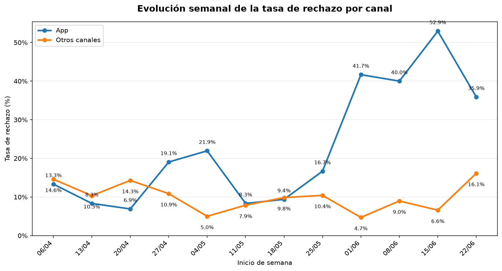

# Informe Ejecutivo
## Incremento en la tasa de rechazo de operaciones en la App

**Destinatario:** Gerente de Canales Digitales  
**Período analizado:** 1 de abril al 29 de junio de 2026

---

# Resumen Ejecutivo

Se confirma un **incremento significativo en la tasa de rechazo de las operaciones realizadas desde la App** durante las últimas cuatro semanas del período analizado.

Los principales hallazgos son:

- El problema comenzó en la **primera semana de junio**.
- Se encuentra **concentrado en la App**; el resto de los canales mantiene un comportamiento estable.
- Afecta tanto operaciones de **crédito** como de **débito**.
- Los segmentos **Corporativo** y **Retail** presentan el mayor incremento en la tasa de rechazo.
- Con la información disponible es posible **cuantificar el problema**, pero **no identificar su causa raíz**.

---

# ¿Qué pasó?

La tasa de rechazo de las operaciones realizadas desde la **App** aumentó del **13,42%** al **40,95%**, lo que representa un incremento de **27,53 puntos porcentuales**.

En el mismo período, el resto de los canales se mantuvo prácticamente estable, pasando del **10,39%** al **9,22%**.

Esto indica que el deterioro observado está concentrado en la App y no corresponde a un problema general del procesamiento de operaciones.

---

# ¿Desde cuándo?

A partir de la **primera semana de junio** se observa un incremento sostenido en la tasa de rechazo de la App, mientras que el resto de los canales mantiene un comportamiento estable durante todo el período analizado.

---

# ¿A quién afecta?

Los segmentos más afectados son **Corporativo** y **Retail**, que presentan incrementos cercanos a **28 puntos porcentuales** en la tasa de rechazo y un aumento en la cantidad absoluta de operaciones rechazadas.

El segmento **PyME** también muestra una tasa de rechazo superior al período anterior, aunque con un volumen de operaciones considerablemente menor y sin incremento en la cantidad de rechazos.

---

# ¿De cuánto es el impacto?

Durante todo el período analizado (01/04/2026 al 29/06/2026) se registró el siguiente impacto acumulado:

| Indicador | Resultado |
|---|---:|
| Operaciones rechazadas | **76** |
| Cuentas afectadas | **24** |
| Monto rechazado | **$9.152.565** |
| Monto rechazado sobre el total operado en la App | **20,12%** |

> La tasa de rechazo se calcula considerando únicamente las operaciones resueltas (aprobadas + rechazadas). Las métricas económicas corresponden al período completo analizado.

---

# Recomendación inmediata

Se recomienda priorizar la investigación sobre la **App**, comenzando por los cambios o despliegues realizados desde fines de mayo y principios de junio.

Acciones sugeridas:

- Analizar los códigos y motivos de rechazo.
- Revisar los logs técnicos de las operaciones fallidas.
- Correlacionar el inicio del incremento con despliegues o cambios recientes.
- Validar si el problema se concentra en determinadas versiones de la App.

### Información adicional necesaria

Para identificar la causa raíz sería conveniente incorporar:

- Versión de la App utilizada.
- Sistema operativo y dispositivo.
- Fecha de despliegues recientes.
- Logs técnicos del procesador de pagos.

---

# Conclusión

La evidencia disponible confirma un problema específico en la **App**, iniciado durante la **primera semana de junio**, con impacto principalmente en los segmentos **Corporativo** y **Retail**.

El siguiente paso debe enfocarse en identificar la causa raíz mediante el análisis de los rechazos y su correlación con los cambios implementados en la aplicación, evitando asumir una causa que no pueda demostrarse con la información disponible.